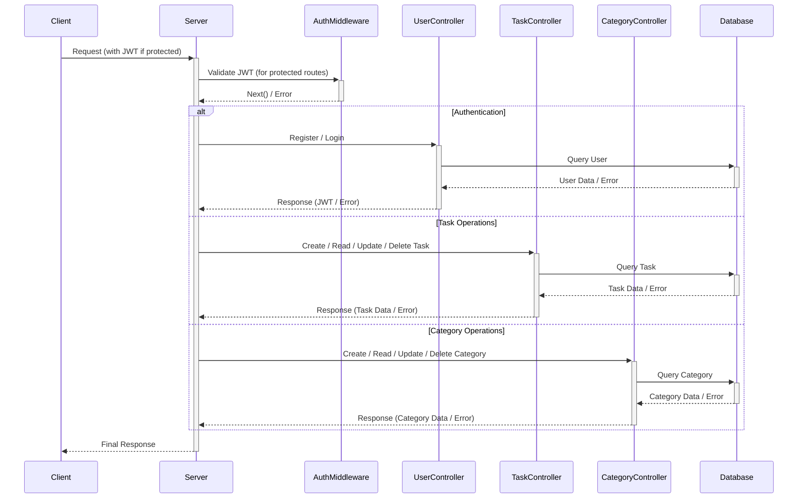

# Personal Task Manager API

This project is a Personal Task Manager API built with Node.js, Express.js, and MongoDB. It allows users to manage their tasks through CRUD operations and organizes tasks into categories. The API uses JWT for authentication, ensuring that only authenticated users can perform operations beyond signing up and logging in.


## Sequence diagram



## Getting Started

### Prerequisites

- Node.js
- MongoDB
- npm or yarn

### Installation

1. Clone the repository to your local machine.
```bash
git clone <repository-url>
```

2. Navigate to the project directory.
```bash
cd personal-task-manager-api
```

3. Install the dependencies.
```bash
npm install
```
or
```bash
yarn install
```

4. Create a `.env` file in the root directory and add the following variables:
```
PORT=3000
MONGO_URI=<your_mongodb_uri>
JWT_SECRET=<your_jwt_secret>
```

### Running the API

Start the server with:
```bash
npm start
```
or
```bash
yarn start
```

The server will run on `http://localhost:3000` by default.

## API Endpoints

### Public Endpoints

These endpoints do not require authentication.

- **POST /api/users/register**: Register a new user.
- **POST /api/users/login**: Login an existing user.

### Protected Endpoints

All other endpoints require authentication. Ensure to include a valid JWT in the Authorization header of your requests.

#### Users

- **GET /api/users/profile**: Retrieve the current user's profile.
- **PATCH /api/users/profile**: Update the current user's profile.
- **DELETE /api/users/profile**: Delete the current user's profile.

#### Tasks

- **POST /api/tasks**: Create a new task.
- **GET /api/tasks**: Retrieve all tasks for the logged-in user.
- **GET /api/tasks/:id**: Retrieve a task by ID.
- **PATCH /api/tasks/:id**: Update a task.
- **DELETE /api/tasks/:id**: Delete a task.

#### Categories

- **POST /api/categories**: Create a new category.
- **GET /api/categories**: Retrieve all categories for the logged-in user.
- **GET /api/categories/:id**: Retrieve a category by ID.
- **PATCH /api/categories/:id**: Update a category.
- **DELETE /api/categories/:id**: Delete a category.

## Error Handling

The API includes error handling middleware that catches and returns errors in a structured format.

## Documentation

For more detailed API documentation, refer to `utils/apiDocumentation.js`.

## Contributing

Contributions are welcome. Please open an issue first to discuss what you would like to change.

## License

[MIT](https://choosealicense.com/licenses/mit/)
